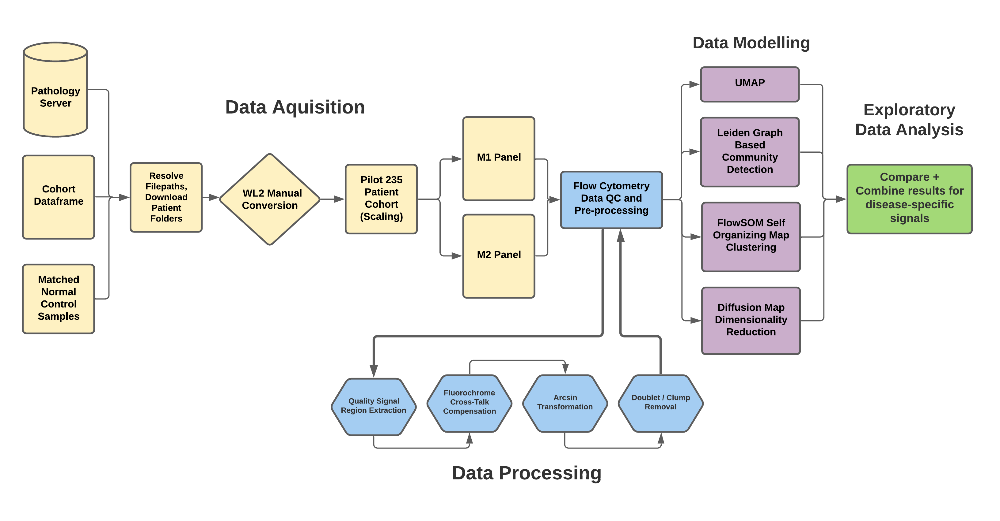
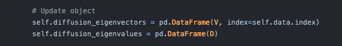
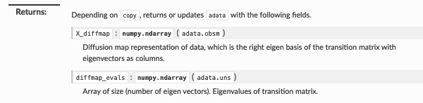
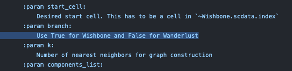
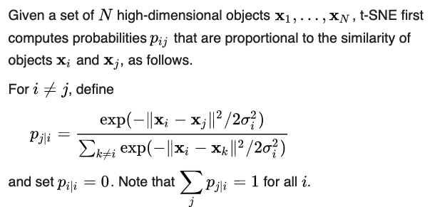
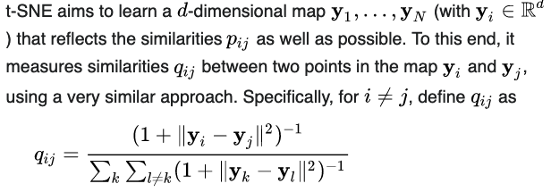
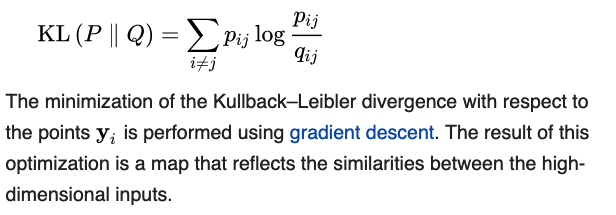
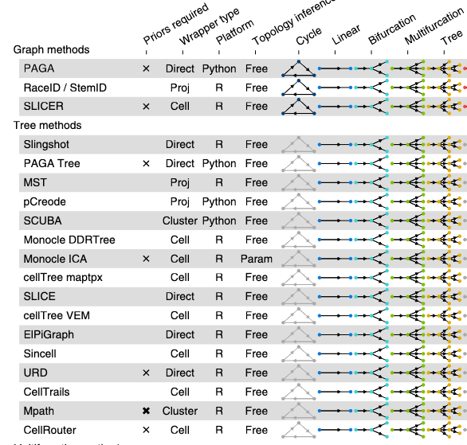
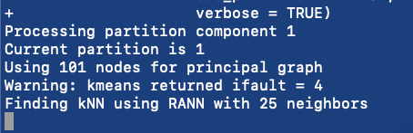

# A Pipeline for Pan-Myeloid Flow Cytometry Data Processing and Clustering Analysis

*Presented to the Faculty of the Weill Cornell Graduate School of
Medical Sciences Cornell Universityin Partial Fulfillment of the
Requirements for the Degree of Master of Science in Computational
Biology*

by Jake Sauter May 2020

© 2021 Jake Sauter

# Table of Contents

    ## ℹ Sourcing https://gist.githubusercontent.com/gadenbuie/c83e078bf8c81b035e32c3fc0cf04ee8/raw/57e7c1a8caed373d9cca7e248cb972d01d26678a/render_toc.R

    ## ℹ SHA-1 hash of file is d520b023f6a9715c381801b34fb1942629f2df12

-   [A Pipeline for Pan-Myeloid Flow Cytometry Data Processing and
    Clustering
    Analysis](#a-pipeline-for-pan-myeloid-flow-cytometry-data-processing-and-clustering-analysis)
-   [Abstract](#abstract)
-   [Biographical Sketch](#biographical-sketch)
-   [Dedication](#dedication)
-   [Acknowledgements](#acknowledgements)
-   [Contributions of Author](#contributions-of-author)
-   [List of Tables](#list-of-tables)
-   [List of Figures](#list-of-figures)
-   [List of Abbreviations](#list-of-abbreviations)
-   [Introduction](#introduction)
    -   [Myeloid Disorders](#myeloid-disorders)
    -   [Flow Cytometry](#flow-cytometry)
    -   [Clustering](#clustering)
-   [Methods](#methods)
    -   [Flow Cytometry Data
        Processing](#flow-cytometry-data-processing)
    -   [Clustering](#clustering)
    -   [Dimensionality Reduction](#dimensionality-reduction)
    -   [Trajectory Inference](#trajectory-inference)
-   [Results](#results)
-   [Conclusions](#conclusions)
-   [References](#references)
-   [Code Repository](#code-repository)
-   [Notes](#notes)
    -   [Research Presentation in a
        Month](#research-presentation-in-a-month)
    -   [Normal Bone Marrow Samples](#normal-bone-marrow-samples)
    -   [Robustness of pipeline](#robustness-of-pipeline)
    -   [Experimental Take-Aways](#experimental-take-aways)
    -   [Notes From MIND Presentation](#notes-from-mind-presentation)
    -   [Lab Meeting / Research Day](#lab-meeting--research-day)
    -   [Possible Pre-Processing
        Improvements](#possible-pre-processing-improvements)
    -   [Diffusion Maps](#diffusion-maps)
    -   [Trajectory Inference /
        Pseudotime](#trajectory-inference-/-pseudotime)
    -   [Combining flow initiatives](#combining-flow-initiatives)
    -   [SPADE.downsampleFCS()](#spade.downsamplefcs())
    -   [Observations in Cohort](#observations-in-cohort)
    -   [Normal Samples Diffusion Map Colored by
        Leiden](#normal-samples-diffusion-map-colored-by-leiden)
    -   [Normal Samples PAGA graph](#normal-samples-paga-graph)
    -   [Research Day](#research-day)
        -   [Next Steps](#next-steps)
        -   [Prioritization](#prioritization)
        -   
        -   [Wishbone (Wanderlust++)](#wishbone-(wanderlust++))
        -   [Wanderlust](#wanderlust)
        -   [Wishbone](#wishbone)
    -   [Monday November 11th](#monday-november-11th)
        -   
        -   [Optimal Trajectory Inference Methods for our
            case](#optimal-trajectory-inference-methods-for-our-case)
    -   
    -   [Research Day Presentation](#research-day-presentation)
        -   [FlowJo License](#flowjo-license)

# Abstract

\[Text. Indent first line of every paragraph.\]

# Biographical Sketch

Jake Sauter recieved his B.S. in Applied Mathematics from State
University of New York at Oswego and is now a candidate for the Master’s
of Science in Computational Biology at Weill Cornell Graudate School of
Medical Sciences. Jake has completed his thesis work as a member of the
lab of Dr. Elli Papaemmauil in the Department of Biostatistics and
Epidemeology at Memorial Sloan Kettering Cancer Center.

# Dedication

This work is dedicated to my previous and current academic influences,
as well as to the families effected by devastating bone marrow cancers
and disorders.

# Acknowledgements

I would like to thank Elli Papaemmanuil for letting me join the lab and
work alongside the fantastic team she has put together Georgios
Asimomitis for mentoring me, always providing a wealth of ideas and
directions that could prove frutiful. I would also like to thank Ronglai
Shen for co-mentoring me and providing an outside perspective Mikhail
Roshal for providing extensive data expert pathological insight on the
Armaan Kholi for assisting with engineering tasks on the project. I am
greatful for effort you all have provided to help build my career in
Computational Biology.

# Contributions of Author

Unless specified otherwise here (and in

# List of Tables

Table 1: Title . . . . . . . . . \#\#

Table 2: Title . . . . . . . . . \#\#

# List of Figures

Figure 1: Title . . . . . . . . . \#\#

Figure 2: Title . . . . . . . . . \#\#

# List of Abbreviations

AUC Area under curve  
cfDNA Cell free DNA  
CIN Chromosomal instability  
CNV Copy number variation  
ctDNA Circulating tumor DNA  
ecDNA Extrachromosomal DNA  
MSK Memorial Sloan Kettering  
NGS Next Generation Sequencing  
ROC Receiver operating characteristic  
UMI Unique molecular index  
VAF Variant Allele Frequency  
PSA Prostate specific antigen  
NSE Neuroendocrine markers  
TF Transcription factor  
TCGA The Cancer Genome Atlas  
GES Gene expression signatures  
GSEA Gene Set Enrichment Analysis  
NES Normalized enrichment score  
ES Enrichment score  
FDR False discovery rate

# Introduction

I am working on a project under MSK MIND, we have this data, I do
preprocessing, clustering and trajectory inference. The pipeline is nice
and reproducible.

## Myeloid Disorders

## Flow Cytometry

## Clustering

# Methods

## Flow Cytometry Data Processing

Flow cytometry is a method to study …

## Clustering

Clustering is an unsupervised machine learning technique …

## Dimensionality Reduction

Dimensionality reduction is the method of projecting / visualizing a
higher dimensional space in a lower dimensional space such that the
maximal amount of information (possibly being relations between data
points) is retained

Dimensionality reduction could prove fruitful in the field of flow
cytometry and pathology as pathologists determine cell populations and
disease state through a series of one or two-dimensonal plots in which
multi-variable patterns could be missed

## Trajectory Inference

Trjaectory inference can be used independently or alongside clustering
analysis to

# Results

# Conclusions

# References

1.  <a href="https://www.jimmunol.org/content/jimmunol/205/3/864.full.pdf" class="uri">A Comprehensive Workflow for Applying Single-Cell Clustering and Pseudotime Analysis to Flow Cytometry Data</a>

    -   Helpful blueprint for flow cytometry data-processing

2.  <a href="https://arxiv.org/abs/1305.1422" class="uri">Somoclu: An Efficient Parallel Library for Self-Organizing Maps</a>
    <https://cran.microsoft.com/snapshot/2017-09-08/web/packages/Rsomoclu/Rsomoclu.pdf>

3.  [The dynamics and regulators of cell fate decisions are revealed by
    pseudotemporal ordering of single cellsSingle-Cell Mass Cytometry of
    Differential Immune and Drug Responses Across a Human Hematopoietic
    Continuum](https://www.nature.com/articles/nbt.2859)

4.  <a href="https://www.nature.com/articles/s41596-019-0246-3.pdf?proof=t" class="uri">FLOW-MAP: a graph-based, force-directed layout algorithm for trajectory mapping in single-cell time course datasets</a>

5.  <a href="https://www.nature.com/articles/s41587-019-0071-9.pdf" class="uri">A comparison of single-cell trajectory inference methods</a>

6.  <a href="https://www.science.org/lookup/doi/10.1126/science.1198704" class="uri">Single-Cell Mass Cytometry of Differential Immune and Drug Responses Across a Human Hematopoietic Continuum</a>

7.  [Extracting a Cellular Hierarchy from High-dimensional Cytometry
    Data with SPADE cell
    assign](https://www.ncbi.nlm.nih.gov/pmc/articles/PMC3196363/)

8.  [Diffusion maps for high-dimensional single-cell analysis of
    differentiation
    data](https://academic.oup.com/bioinformatics/article/31/18/2989/241305)

9.  <a href="https://www.nature.com/articles/s41592-019-0529-1.pdf" class="uri">Probabilistic cell-type assignment of single-cell RNA-seq for tumor microenvironment profiling</a>

10. [Slingshot: Cell lineage and pseudotime inference for single-cell
    transcriptomics](https://www.biorxiv.org/content/10.1101/128843v1.full)

11. [Extracting a cellular hierarchy from high-dimensional cytometry
    data with SPADE](https://pubmed.ncbi.nlm.nih.gov/21964415/)

12. <a href="https://inside.mines.edu/~whereman/talks/delaPorte-Herbst-Hereman-vanderWalt-DiffusionMaps-PRASA2008.pdf" class="uri">An Introduction to Diffusion Maps</a>.

13. <a href="https://pydiffmap.readthedocs.io/en/master/theory.html" class="uri">pydiffmap Diffusion Maps Theory</a>

14. <a href="https://academic.oup.com/bioinformatics/article/28/18/2400/251629" class="uri">CytoSPADE: high-performance analysis and visualization of high-dimensional cytometry data</a>

15. <a href="https://www.nature.com/articles/s41587-019-0071-9.pdf" class="uri">A comparison of single-cell trajectory inference methods</a>

16. <a href="https://static-content.springer.com/esm/art%3A10.1186%2Fs13059-019-1663-x/MediaObjects/13059_2019_1663_MOESM1_ESM.pdf" class="uri">PAGA: graph abstraction reconciles clustering with trajectory inference through a topology preserving map of single cells - Genome Biology</a>

    1.  <a href="https://static-content.springer.com/esm/art%3A10.1186%2Fs13059-019-1663-x/MediaObjects/13059_2019_1663_MOESM1_ESM.pdf" class="uri">PAGA Supplementary File 1 – Methods</a>

17. <a href="https://onlinelibrary.wiley.com/doi/10.1002/eji.201646632" class="uri">Guidelines for the use of flow cytometry and cell sorting in immunological studies*</a>

18. <a href="https://onlinelibrary.wiley.com/doi/10.1002/cyto.a.23664" class="uri">Implementation and Validation of an Automated Flow Cytometry Analysis Pipeline for Human Immune Profiling</a>

19. <a href="https://onlinelibrary.wiley.com/doi/10.1002/cyto.b.20554" class="uri">Elucidation of seventeen human peripheral blood B-cell subsets and quantification of the tetanus response using a density-based method for the automated identification of cell populations in multidimensional flow cytometry data</a>

20. [Exploration of Cell Development Pathways through High-Dimensional
    Single Cell Analysis in Trajectory
    Space](https://www.cell.com/iscience/pdf/S2589-0042(20)30025-0.pdf)

21. [Algebraic approach to single-pushout graph
    transformatio](https://www.researchgate.net/publication/223806275_Algebraic_approach_to_single-pushout_graph_transformation)

# Code Repository

Code and documentation associated with this paper can be found at the
following github repsitory:
<https://github.com/jakesauter/Masters_Thesis>

# Notes

## Research Presentation in a Month

-   Research Day: Primary and secondary mentors are invited ⁃ Monday
    before thanksgiving ⁃ November 22nd

-   Would like to have some nice visuals that I have analyzed and some
    conclusions

## Normal Bone Marrow Samples

-   55 Normals ⁃ Could not find top level MRN folder for 1 patient ⁃
    More than one MRN folder found for 1 patient

## Robustness of pipeline

-   Cell ids before down-sampling?

## Experimental Take-Aways

-   SPADE diffusion maps ⁃ Behavior is not patient-specific, but method
    (SPADE) specific ⁃ Does not depend on number of neighbors

## Notes From MIND Presentation

-   MPN Diagnostic Workup ⁃ Relies on Morphology ⁃ Less than 30% blasts
    MDS vs AML

-   Flow cytometry is a useful method of measurement as it can capture
    multi-dimensional signals at a single-cell level ⁃ What is FSC, SSC
    ⁃ Conjugated antiobdies for markers of interest ⁃ M1 and M2 tube

-   Processing Pipeline ⁃ Step by step going through ⁃ Keeping table of
    content on the side and highlighting ⁃ Reference in small text at
    bottom of slide

-   Normalization ⁃ Gaussnorm not really working ⁃ Split into batches to
    only shift batch-wise and not sample-wise ⁃ Will determine shifts
    based off of “normal” samples

-   Downsampling ⁃ One option is uniform random sampling ⁃ SPADE
    density-based downsampling ⁃ Don’t over-sample cells in dense
    regions

-   Data Mining ⁃ Self Organizing Maps ⁃ Leiden Community Detection ⁃
    Diffusion Maps ⁃ UMAPs

-   Sarab Shah: ⁃ Complemented the project ⁃ Cell assign:
    <https://www.nature.com/articles/s41592-019-0529-1.pdf> ⁃ Wants us
    to talk to Toxicity project ⁃ Standardized code running to share
    with other project ⁃ Maybe run Leiden on data and subsample per
    cluster in order to subsample cells ⁃ Do you have quantification of
    cell types

-   Jacob Glass ⁃ Has been in contact with Brent Wood ⁃ Can parse blast
    from reports

## Lab Meeting / Research Day

-   Start thinking of lab meeting

-   Anybody in the project should attend

    -   Of course co-supervisor should attend

## Possible Pre-Processing Improvements

-   How did previous papers find the optimal cofactor

    -   Controls?

## Diffusion Maps

-   Can we see the eigenvalues of the diffusion components to see how
    important some are?

    -   Seems like a good piont but I think they are just comparable

    -   Maybe increases processing time because number of components is
        a paramaeter to scanpy diffusion

-   A Diffusion map is the basis transformation using the eigenvectors
    associated with the M largest eigenvalues of the Diffusion Distance
    Matrix, where the distance between coordinates of the data points in
    the new space approximates the diffusion distance, where the
    diffusion distance is the sum of the (non-normalized?) probabilites
    (density?) of the start and end points being strongly connected
    through every other point for which a path exists (p &gt; 0)

    -   Define a kernel K and calculate the kernel matrix (distances /
        non-normalized probs)

    -   Diffusion matrix = row normed K

    -   Eigenvectors of Diff Mat

    -   Map to the d-dimensional diffusion space at time t, using d
        dominant eigenvectors indicated by the magnitude of their
        eigenvalue

        -   Ex. y\_1 = a1*x\_1 + a12*x\_2 + … + a1n*x\_n y\_2 = a1*x\_1
            + a2*x\_2 + … + an*x\_n … y\_n = a1*x\_1 + a2*x\_2 + … +
            an\*x\_n

## Trajectory Inference / Pseudotime

-   Try these three methods

    -   PAGA

    -   Wishbone

    -   Wanderlust

## Combining flow initiatives

-   Sarab shah wants a flow-cyto pipeline focused meeting

-   Maybe a 30 minute presentation Wednesday 4-5pm

-   18-20 people to bring together flow initiatives

-   Table of runtime per step per sample, explain different steps

## SPADE.downsampleFCS()

-   target\_pctile — Numeric value in \[0,1\]. Densities below this
    percentile, but above exclude\_pctile will be retained. Only
    meaningful if desired\_samples is NULL.

-   desired\_samples — Desired number of samples. If set to integer
    value, the target percentile will be set internally to downsample to
    approximately the desired number of samples.

-   Seems like SPADE.downsampleFCS() only includes samples within a
    certain range of density, when it seems like in our case it would be
    best to retain all cell types, just at similar densities?

⁃ Can’t trust the Disease annotations until they are reviewed ⁃ Misha
said review genomic clusters

## Observations in Cohort

-   From what Misha has previously said, we can’t compare the entire
    distribution over any marker as the distribution of cell types is
    different for every patient

-   Could plot Normal sample cells on diseased umap to see where samples
    are falling

    -   Don’t think Scanpy UMAP supports returning the model and using
        it to map new points, so would have to re-run
        `scanpy.pp.neighbors(k = 30)` for **normals + diseased** cohort,
        which we were going to wait on anyway

    -   This is essentially trying to peek into the enrichment of leiden
        clusters run with all data together, which we will do soon

## Normal Samples Diffusion Map Colored by Leiden

-   First component of diffusion map did not mean anything, it is the
    steady state solution

-   Plotting first two diffusion components of Normals and put on slides

-   Calculating the 3rd diffusion component now

    -   Should do the same thing for the diseased cohort? – Not if going
        to run all samples together soon

## Normal Samples PAGA graph

-   Need to re-run leiden with lower resolution (.3 ? – discuss in
    meeting)

## Research Day

-   Normalization

    -   Need to normalize samples by finding a representative population
        for each marker

    -   According to what Misha has said, **if** the samples truly have
        no presence of disease the height of the peaks may be different
        but the **location** of the peaks should not be different
        between normal patients

    -   I have seen from a few sources that flow can be useless to
        compare if there is not a control sample

    -   Controls are run through the machine but they are not for every
        channel?

-   Proposed idea of checking the distribution of cells within batches
    within each leiden community, as each leiden community will be a
    pseudo cell type, then we can compare the mean marker expression
    between all of the cells that came from one batch versus cells that
    came from another batch

    -   There is no gaurantee that these unsupervised clusters retain
        pure cell types in which we can expect that the distrubtion of
        cell markers should be consistent and at a baseline level

### Next Steps

-   Going to given leiden a chance, though do not let pipeline crumble
    while I am working on Normalization with no gating information

    -   Need to ensure that cell labels follow expression data from the
        beginning of the pipeline

    -   Maybe we should keep all the metadata in a centralized object
        for plotting with the data (like Seurat), but this leads to
        problems as its very hard to load in an object that size

        -   I will keep a metadata table seperate that can be used to
            key-on

-   Identify best possible matching leiden community for each marker
    channel in the M1 tube

    -   Con – this is basically using Leiden as an automated gating
        methodolgy, which there is most likely something more
        specialized for automated gating that would

        -   Have expression UMAPs for Normals ready (already done)

        -   Identify the best output object to use based on resolution
            parameter

        -   Plot the leiden communities on the normal umap (if not
            already done)

### Prioritization

-   Ensure robustness of the pipeline to this point, and ensure that
    flow directories are properly following their cells.

    -   Also scout out what would need to be done for adding cell
        labels, possibly just being the flow directory followed by the
        index. This could be before or after downsampling.

-   See what we can do with normalization for now. I still feel like we
    need to wait for gate parsing info to have cell labels to normalize
    the correct way, or have a pathologist re-annotate the normal
    samples in FlowJo with the normal populations that we need to
    annotation

-   If there is still a problem, do not act like there is not a problem.

    -   Take a look at the leiden communities today and see if it looks
        like they can be used for normalization. If they cannot be used
        for normalization, then we will have to request for more expert
        help on identifying these populations to normalize properly

    -   I know that we are just trying to do something practical that
        works,

### 

### Wishbone (Wanderlust++)

-   [Wishbone identifies bifurcating developmental trajectories from
    single-cell
    data](https://www.ncbi.nlm.nih.gov/pmc/articles/PMC4900897/)

-   Wishbone is built on Wanderlust and allows for a bifurcation in the
    graph topology, whereas Wanderlust creates a [linear
    graph](https://en.wikipedia.org/wiki/Path_graph "Path graph").
    Wishbone combines principal component analysis and [diffusion
    maps](https://en.wikipedia.org/wiki/Diffusion_maps) to achieve
    dimensionality reduction then also creates a
    [KNN](https://en.wikipedia.org/wiki/K-nearest_neighbors_algorithm "K-nearest neighbors algorithm")
    graph.[\[16\]](https://en.wikipedia.org/wiki/Trajectory_inference#cite_note-:2-16)

-   I think both Wishbone and Wanderlust were developed by Dana Pe’er ’s
    lab

-   Out of all of the pseudtime methods that I was taking a look at
    (Monocle, Slingshot, Wishbone), Wishbone seems to be the most
    intersting currently as they have already mentioned diffusion maps,
    but the biggest deal is that they allow for bifurcations in the
    pseudotime graph, which we should definitely have in bone marrow
    samples

-   **Wishbone only allows for one bifurcation in the trajectories**

    -   Wouldn’t we expect many bifurcations as apart of the
        hematopoeitic differentiation tree?

    -   “We also apply the algorithm to mouse myeloid differentiation
        and demonstrate its generalization to additional lineages”

    -   “A comparison of Wishbone to diffusion maps, SCUBA and Monocle
        shows that it outperforms these methods both in the accuracy of
        ordering cells and in the correct identification of branch
        points.”

### Wanderlust

-   [Single-Cell Trajectory Detection Uncovers Progression and
    Regulatory Coordination in Human B Cell
    Development](https://www.sciencedirect.com/science/article/pii/S0092867414004711?via%3Dihub)

-   “Using the trajectory, we determined the timing and order of key
    molecular and cellular events across development, including
    identifying previously unrecognized subsets of B cell progenitors
    that pinpoint the timing of DJ and [V(D)J
    recombination](https://www.sciencedirect.com/topics/immunology-and-microbiology/v-d-j-recombination "Learn more about V(D)J Recombination from ScienceDirect's AI-generated Topic Pages")
    of the IgH.”

-   " Wanderlust overcomes short circuits by building an ensemble of
    graphs
    ([Figure 1](https://www.sciencedirect.com/science/article/pii/S0092867414004711?via%3Dihub#fig1)C).
    The exact set of neighbors varies between each graph, so any
    randomly occurring short circuit appears in very few graphs in the
    ensemble"

    -   Random graphs are generated by randomly selecting i out of k
        nearest neighbors

### Wishbone

-   <https://github.com/dpeerlab/wishbone>
-   Today I will be working to run wishbone on our current data, and
    maybe cleaning up some objects in the process
-   It doesn’t look like I need to run tsne as it is just for
    vizualization, though run\_wishbone does require the diffusion
    components (which we might be able to inject from scanpy diffusion
    map result for speed)
-   
-   
-   So all I should have to do is set

wishbone\_object.diffusion\_eigenvectors =
pd.DataFrame(scanpy\_ad.obms\[‘X\_diffmap’\])

wishbone\_object.diffusion\_eigenvalues =
pd.DataFrame(scanpy\_ad.uns\[‘diffmap\_evals’\])

## Monday November 11th

-   **Re-read the comparison of pseuodtime techniques**

    -   **Additional literature review of pseudotime in flow cytometry**

-   Optimal trajectory inference method would have

    -   **no bifurcation-number restriction**

    -   Provides a single psuedotime value for every cell (additional
        information ontop is okay)

-   Follow up with Fabio to aquire 1-2 FlowJo liscences (or just one for
    me if pathology already has these)

-   Plot branch value and pseudotime cell value on Normal sample UMAP

    -   Use this as an exercise to make one object that is easily
        plottable

-   Keep presentation in mind

    -   

-   tSNE is a popular visualization for trajectory inference as it
    maintains local distances very well (which matter heavily in a
    trajectory), while allowing for some global variation

    -   tSNE iteratively optimized the KL divergence between the joint
        probabilities of each data point and its neighbors from high
        dimensional data space to the target, low dimensional data space

    -   

    -   

    -   

-   Currently the fastest tSNE implementation I have available is
    running, so I think I should really plot the pseudotime values on
    the normal umap. I will do this when I sit down again. Good working
    session this morning

### 

### Optimal Trajectory Inference Methods for our case

-   We essentially would like a “tree” structure

-   

-   Which leaves us with PAGA, Slingshot, PCreode, SCUBA, and Monocle

-   PAGA determines connectivities between clusters and is meant to be
    used in an exploratory manner, so this crosses it off our list of
    pseuodtime generating methods that will help us sort cells along a
    differentiation spectrum

-   Slingshot’s limiting factor is it’s processing time, restriced to a
    single-threaded process

Monocle uses RANN even when leiden clusters and “partitions” (probably
disjoint graphs/trajectories) are provided, this will probably be the
slow aspect

## 

## Research Day Presentation

-   Possible schedule to meet with Ronglai before and get comments on
    the project

    -   Maybe Ronglai should also be in the lab meeting

-   Presentation coming up soon, I’d like to have a convincing
    trajectory inference visualization to show

    -   3D Monocle Trajectory?

    -   Run with leiden to find disjoint partitions?

        -   Not sure if I can inject the right info for this as they
            call special igraph functionality within the clustering step
            as well and pass around specialized objects

-   Could be cool to show the PAGA tree layout

-   Validating the cell types of each cluster

-   Showing differentiation through trajectory inference

-   Lineage branching through branch number

-   Exploration of different trajectory inference methods

-   Comparing differential differentiation trajectories between
    diseases?

    -   Not sure this would work but starting to think of interesting
        ideas now using more powerful methods that can cut through the
        noise of non-controlled experiements  

-   Monocle 3 finished for the control cohort, I think this means that
    it took only about a day to run which for the entire 14 dimensional
    dataset, and only overnight in 3D for the normal cohort

### FlowJo License

-   Ask Genesis for pay code for $200 FloJo License

-   Starting to think about what results I want to present for a
    research presentation coming up Next **Tuesday the 23rd @ 3pm**
    (anyone is invited to attend virtually)

-   Elli wants to do a lab Christmas event, though she might not be able
    to completely participate

-   Elli wants us to start lab meeting in January and we can send update
    emails to her outling the status of the projects

Elli will NOT be in the office on Tuesday, but will be in on Thursday
(Mirinda is off on Thursday and Friday this week

[Algebraic approach to single-pushout graph
transformation](https://www.researchgate.net/publication/223806275_Algebraic_approach_to_single-pushout_graph_transformation)
